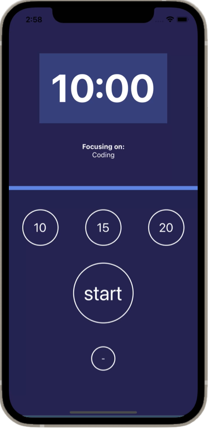

# Focus time app

[ZTM](https://zerotomastery.io) project. The goal of this project was to create a mobile app using Expo Snacks to track the focus time of different activities.

## Preview

## Project walkthrough

1. Insert an activity to focus on.
2. By default the timer will display 6 seconds, you can choose between 10, 15 and 20 minutes.
3. After selecting an amount of time click on "start". In order to pause the timer click on "pause". To restart everything click on "-".
4. The activities that have been successfully completed will show on the history section at the start of the app.
